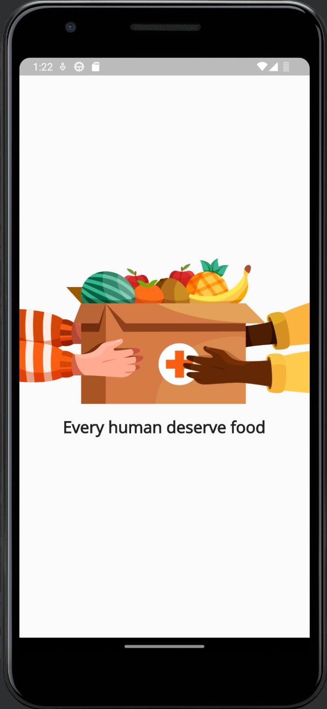
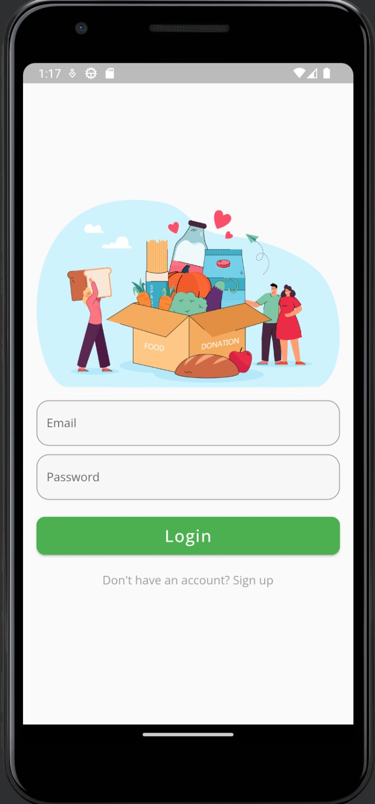
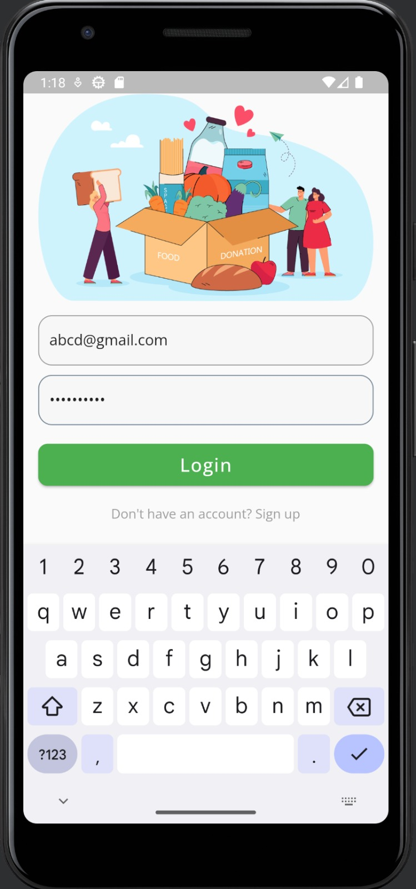
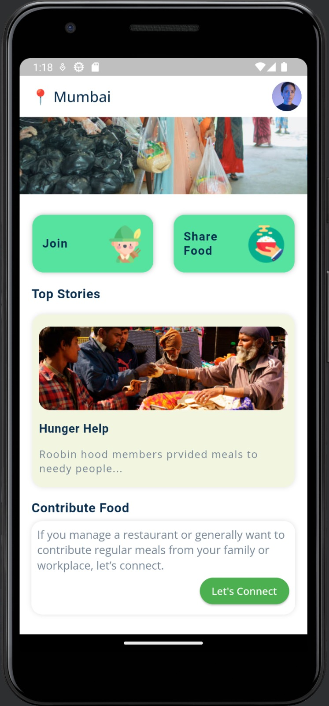
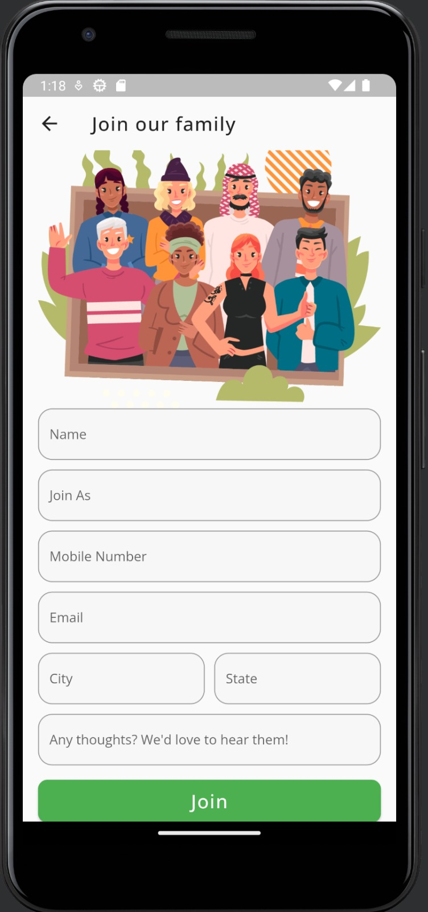
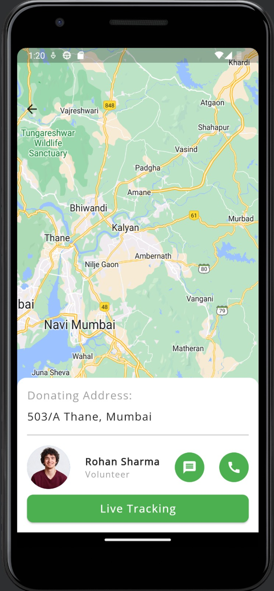

#    Daap    

Lets make a difference 

(A Flutter Project)

## What is the quandary currently confronting us?

Food wastage is a significant problem that affects millions of individuals worldwide, particularly those living in poverty. Each year, one-third of the food produced in the world goes to waste, resulting in roughly 1.3 billion tons of food being discarded, while 690 million people face hunger daily. The impact of food wastage is most profound in developing nations where food production and distribution systems are deficient, and poverty and malnutrition rates are high, resulting in difficulty for many individuals in obtaining the necessary food to survive.

As a consequence, millions of individuals perish each year as a result of insufficient food and resources. It is possible to prevent this tragedy by taking steps to decrease food wastage and enhance food distribution systems. Supporting food banks and food rescue programs that aim to reduce food waste is one approach to accomplish this. Additionally, we can support sustainable agriculture methods that aid in reducing food waste and enhancing food security.

Aside from these efforts, we must also address the underlying causes of poverty and inequality that contribute to food insecurity. This includes promoting economic growth, lowering income inequality, and investing in education and healthcare. Only by working together can we create a world where everyone has enough to eat and where no one goes hungry due to a lack of food and resources.

## Our solution -

Too prevent this resource wastage and help the Community we decided to design an android application  as a solution to the issue primary we are concerned of food waste in commercial kitchens, wedding banquet halls, and other places where large amounts of food, water, and clothing are discarded that can be consumed without any harm. This platform is designed to connect People/NGO'S who need these resources with those who have them in surplus, allowing for easy pickup and delivery to those who are experiencing hardship due to lack of viable resources . Whether you own a restaurant or are planning an event, the app provides a convenient way to make a positive impact in your community by donating unused resources as "one mans excess can be other mans need". By partnering with local charities and food banks, the donations are distributed to those who need them most, creating a more sustainable future to those who are actually trashed by the society and considered to be of no-good. 
This application will not only empower those who are underprivileged but also to those who want to contribute to society but finds it difficult due to the time that it took. so it will only bring more prosperity in their heart and at the end of the day it is all about the happy, relieved  and satisfied faces.

## The Name Daap -

As complex it seems the Daap meant- donors application , a app where you can donate any resources at any time and place

## Technologies

- Flutter

- Firebase Realtime DB

- Firebase Google Auth

- Google Map
 
## Prerequisites

To run any Android application built with Flutter you need to configure the enviroments in your machine, you can do this following the the tutorial provided by Google in Flutter website

- Flutter SDK

- Android Studio (to download Android SDK)/ VS-code

- Xcode (for iOS develop only)

- Any IDE with Flutter SDK installed (ie. IntelliJ, Android Studio etc)

- A little knowledge of Dart and Flutter

## Setup

To run the app you need to have an online emulator or a plugged device and run the following command in the root of the application.

- Android

       flutter run

- iOS (MAC Only)

      flutter run

## Possible next features
The features we can add to this application could be :

- Different languages so it could become more universal.
- Adding more options to donate different resources like water, utensils etc.
- Adding a interface that is secure for donating money from anywhere in any currency 
- Adding a leader board that show from which house/restaurant/area/county maximum amount of donations had arrived.
- Adding a ad window in which one could advertise and the money generated from this will be donated to the local shelter house and NGO's

## App Screenshot
  
  
